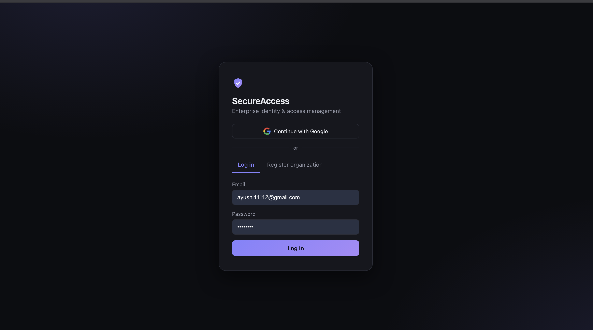
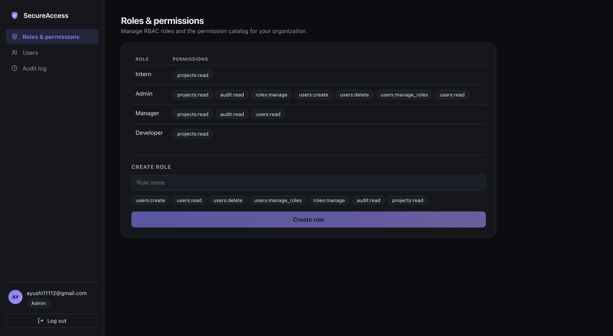
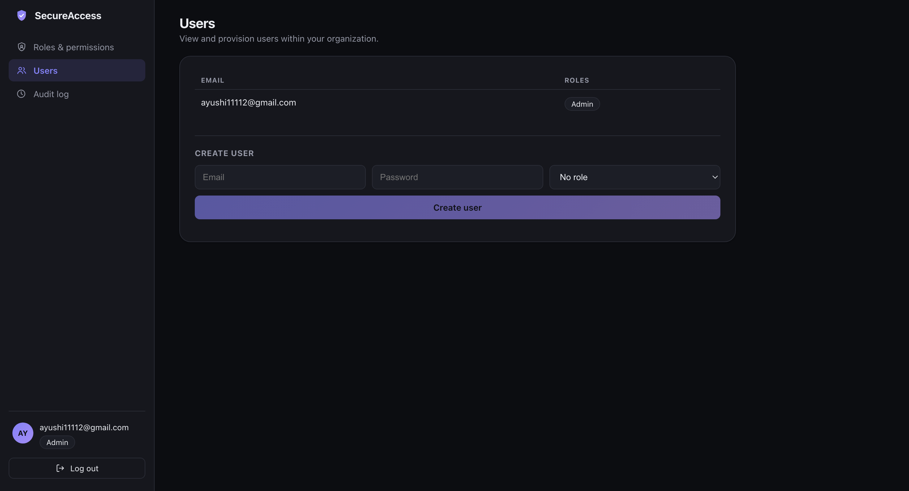
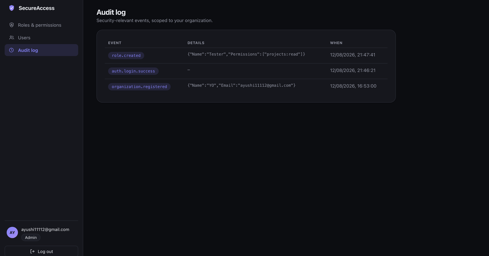

<div align="center">

# SecureAccess

**Multi-tenant Identity & Access Management platform** — JWT auth, Google OAuth, policy-based RBAC, audit logging, and rate limiting, built end-to-end with a live admin UI.

[](https://github.com/ayushii89/SecureAccess/actions/workflows/ci.yml)


[**Live App**](https://frontend-mocha-gamma-16.vercel.app) &nbsp;·&nbsp; [**API + Swagger**](https://auth-production-2188.up.railway.app) &nbsp;·&nbsp; [**Frontend docs**](frontend/README.md)

</div>

---

## Contents

- [Screenshots](#screenshots)
- [Highlights](#highlights)
- [Tech stack](#tech-stack)
- [Architecture](#architecture)
- [Running locally](#running-locally)
- [API reference](#api-reference)
- [Testing](#testing)
- [Deployment](#deployment)
- [Roadmap](#roadmap)

## Screenshots

<table>
<tr>
<td width="50%"><br/><sub>Login — password or Google OAuth</sub></td>
<td width="50%"><br/><sub>RBAC — roles &amp; permission catalog</sub></td>
</tr>
<tr>
<td width="50%"><br/><sub>User provisioning</sub></td>
<td width="50%"><br/><sub>Audit log</sub></td>
</tr>
</table>

## Highlights

| | |
|---|---|
| 🏢 **Real multi-tenancy** | Every org's data is isolated at the ORM layer via EF Core global query filters keyed to the caller's JWT — not just an app-level `WHERE` clause someone can forget. Verified with tests that register two orgs and assert zero cross-tenant visibility. |
| 🔐 **JWT + refresh rotation** | Short-lived access tokens, rotating refresh tokens. Reusing an already-rotated (revoked) token is treated as theft and revokes the entire chain. |
| 🔑 **Google OAuth** | First sign-in auto-creates an org. Tokens never touch the redirect URL — a single-use, 60-second exchange code stands in for them until the frontend swaps it server-side. |
| 🛡️ **Policy-based RBAC** | Roles map to a permission catalog (`users:create`, `roles:manage`, `audit:read`, …), enforced per-endpoint. Four starter roles seeded automatically per org. |
| 📜 **Audit logging** | Every security-relevant event — logins, failures, role/permission changes, user creation — recorded and queryable per-tenant. |
| 🚦 **Rate limiting** | Per-IP sliding-window limits on auth endpoints to blunt credential-stuffing and signup abuse. |
| 🖥️ **Admin frontend** | Role/permission management, user provisioning, audit log viewer — RBAC-aware, so a 403 renders as a clear message, not a broken screen. |
| ✅ **21 integration tests** | Real HTTP requests via `WebApplicationFactory` against a live Postgres database, running in CI on every push. |

## Tech stack

**Backend** — C#, ASP.NET Core 8, Entity Framework Core, PostgreSQL, JWT, Google OAuth
**Frontend** — React, TypeScript, Vite
**Infra** — Railway (API + Postgres), Vercel (frontend), GitHub Actions (CI)
**Testing** — xUnit + `WebApplicationFactory`

## Architecture

```
Organization (tenant)
  └── User ──< UserRole >── Role ──< RolePermission >── Permission
       └── RefreshToken            (per-org, seeded: Admin/Manager/Developer/Intern)
  └── AuditLog
```

Every tenant-scoped table (`Users`, `Roles`, `AuditLogs`) carries an `OrganizationId` plus an EF Core global query filter keyed off the current request's JWT `org_id` claim — a stray query without an explicit `WHERE OrganizationId = ...` still can't leak another tenant's data. `User.PasswordHash` is nullable since Google-only accounts have none.

## Running locally

**API**
```bash
cp src/SecureAccess.Api/appsettings.Development.json.example src/SecureAccess.Api/appsettings.Development.json
# edit the SigningKey, e.g.: openssl rand -base64 32
# Google:ClientId/ClientSecret are optional — password auth works without them

# create a `secureaccess` Postgres database/user matching the connection string, then:
cd src/SecureAccess.Api && dotnet run
```
Migrations and the permission catalog seed automatically on startup. Swagger UI at `/swagger`.

**Frontend**
```bash
cd frontend
npm install && npm run dev
```
Opens on http://localhost:5173 — see [frontend/README.md](frontend/README.md) for structure.

## API reference

| Endpoint | Description |
|---|---|
| `POST /auth/register` | Creates an Organization + first user (Admin role) |
| `POST /auth/login` | Email/password login *(rate limited)* |
| `GET /auth/google/login` | Starts Google sign-in *(rate limited)* |
| `POST /auth/google/exchange` | Swaps a one-time OAuth code for real tokens *(rate limited)* |
| `POST /auth/refresh` | Rotates the refresh token *(rate limited)* |
| `POST /roles` · `/roles/{id}/permissions` · `/roles/assign` | Manage RBAC — requires `roles:manage` |
| `POST /users` | Create users in your org — requires `users:create` |
| `GET /audit-logs` | Security event trail, scoped to your org — requires `audit:read` |

## Testing

```bash
dotnet test
```
21 integration tests covering auth flows, refresh rotation/reuse detection, RBAC enforcement, tenant isolation, rate limiting, and Google sign-in's org-creation logic — all running against a real PostgreSQL instance, not mocks. Runs automatically in [CI](https://github.com/ayushii89/SecureAccess/actions) on every push.

## Deployment

The API is deployed on **Railway** (built directly from source) with a linked Postgres addon. The frontend is a static Vite build on **Vercel**, pointed at the Railway API via `VITE_API_BASE_URL`. Both sides authorize the browser origin through a `Cors:AllowedOrigins` config entry.

> Railway terminates TLS at its edge and forwards plain HTTP to the container, so the API trusts `X-Forwarded-Proto`/`-For` (`ForwardedHeadersOptions`). Without it, the Google OAuth handler would build an `http://` redirect URI that mismatches the `https://` one registered with Google, and the rate limiter's per-IP key would track the proxy instead of the real client.

## Roadmap

- [ ] GitHub OAuth login
- [ ] Resource-level authorization policies beyond role→permission
- [ ] Redis-backed session cache
